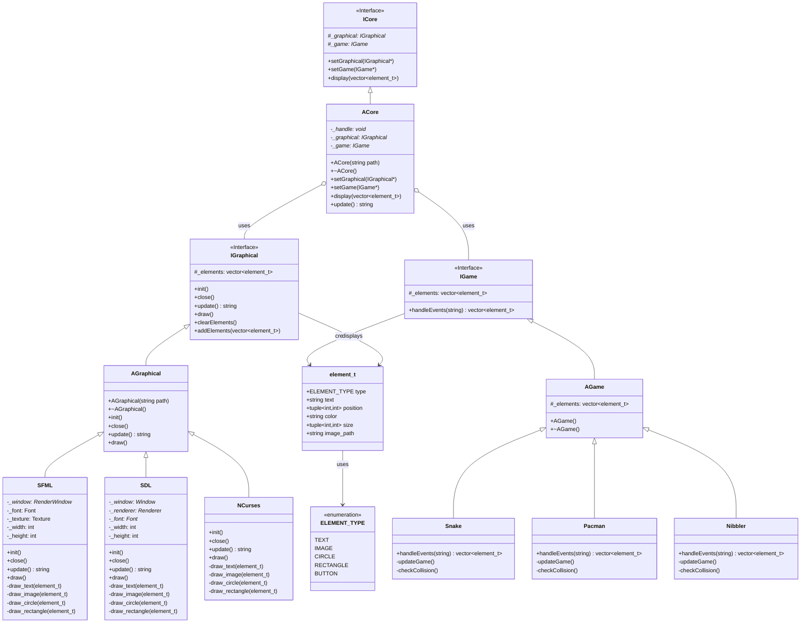

# Arcade Architecture

## Architecture Explanation

### Core System
- **ACore** is the central component that:
  - Dynamically loads graphic libraries (*.so)
  - Manages game loading
  - Coordinates display and updates
  - Handles library switching

### Graphics Interface
- **IGraphical** defines the common interface for all graphic libraries
- **AGraphical** provides the base implementation
- Three libraries implemented: SFML, SDL, NCurses
- Each library can be loaded dynamically at runtime

### Game System
- **IGame** defines the common interface for all games
- **AGame** provides the base implementation for games
- Games are independent of the graphic library used
- Communication through element_t structure

### Data Flow
1. Core loads a graphic library
2. Core loads a game
3. Game receives events through handleEvents()
4. Game generates elements (element_t)
5. Core passes these elements to the graphic library
6. Graphic library displays the elements

### element_t Structure
- Common structure used for communication
- Defines all displayable element types
- Provides abstraction between games and display
- Ensures consistency across different graphics libraries