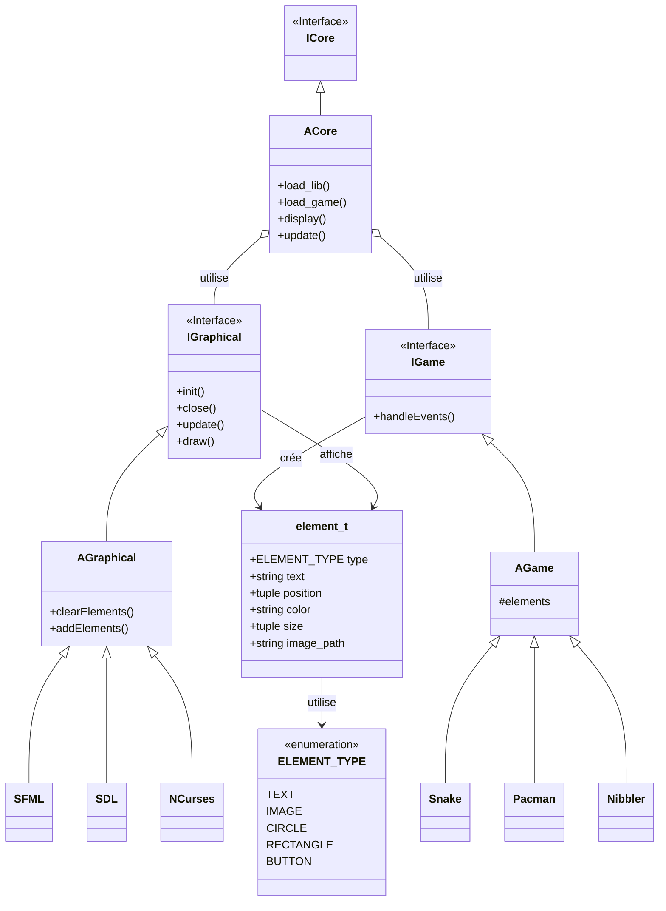

# Architecture Arcade

## Explication de l'Architecture

### Core System
- **ACore** est le composant central qui :
  - Charge les bibliothèques graphiques (*.so)
  - Gère le chargement des jeux
  - Coordonne l'affichage et les mises à jour

### Interface Graphique
- **IGraphical** définit l'interface commune pour toutes les bibliothèques graphiques
- **AGraphical** fournit l'implémentation de base
- Trois bibliothèques implémentées : SFML, SDL, NCurses
- Chaque bibliothèque peut être chargée dynamiquement

### Système de Jeux
- **IGame** définit l'interface commune pour tous les jeux
- **AGame** fournit la base pour l'implémentation des jeux
- Les jeux sont indépendants de la bibliothèque graphique utilisée
- Communication via la structure element_t

### Flux de Données
1. Le Core charge une bibliothèque graphique
2. Le Core charge un jeu
3. Le jeu reçoit les événements via handleEvents()
4. Le jeu génère des éléments (element_t)
5. Le Core transmet ces éléments à la bibliothèque graphique
6. La bibliothèque graphique affiche les éléments

### Structure element_t
- Structure commune utilisée pour la communication
- Définit tous les types d'éléments affichables
- Permet une abstraction entre les jeux et l'affichage