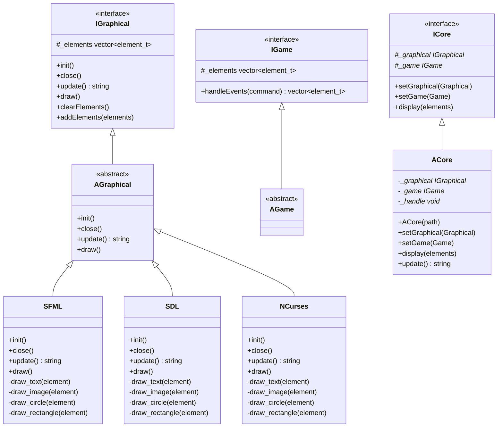

# Arcade Project Class Diagram and Manual

## Class Diagram

## Component Relationships and Flow

### Core System (ACore)
The Core system is the central component that manages the interaction between graphics libraries and games:

1. **Initialization**
   - Core is initialized with a path to a graphics library
   - Loads the graphics library dynamically using dlopen/dlsym
   - Creates an instance of the graphics library
   - Initializes the graphics context

2. **Graphics Library Management**
   - Maintains a pointer to the current graphics library (_graphical)
   - Can switch between different graphics libraries at runtime
   - Handles cleanup and reinitialization when switching libraries

3. **Game Management**
   - Maintains a pointer to the current game (_game)
   - Can switch between different games at runtime
   - Passes game elements to the graphics library for rendering

### Graphics Libraries
Graphics libraries provide the rendering capabilities:

1. **Initialization Flow**
   - Library is loaded by Core via dlopen
   - create() function instantiates the library class
   - init() sets up the rendering context
   - Elements are received through addElements()

2. **Rendering Flow**
   - draw() is called by Core
   - Elements are processed based on their type
   - Specific draw methods handle each element type
   - Screen is updated/refreshed

3. **Event Handling**
   - update() processes input events
   - Returns special commands ("EXIT", "RESIZE")
   - Maintains window/context state

### Games
Games provide the gameplay logic and elements to render:

1. **Event Processing**
   - Receives commands through handleEvents()
   - Updates game state based on input
   - Generates visual elements

2. **Element Generation**
   - Creates element_t structures
   - Sets positions, sizes, colors
   - Returns vector of elements to Core

### Data Flow
1. User Input → Graphics Library (update)
2. Core → Game (handleEvents)
3. Game → Core (element vector)
4. Core → Graphics Library (display/draw)

### Element System
The element_t struct is the common language between all components:
- Games create elements
- Core passes elements
- Graphics libraries render elements

This modular design allows for:
- Easy addition of new graphics libraries
- Simple game implementation
- Runtime switching of components
- Clean separation of concerns