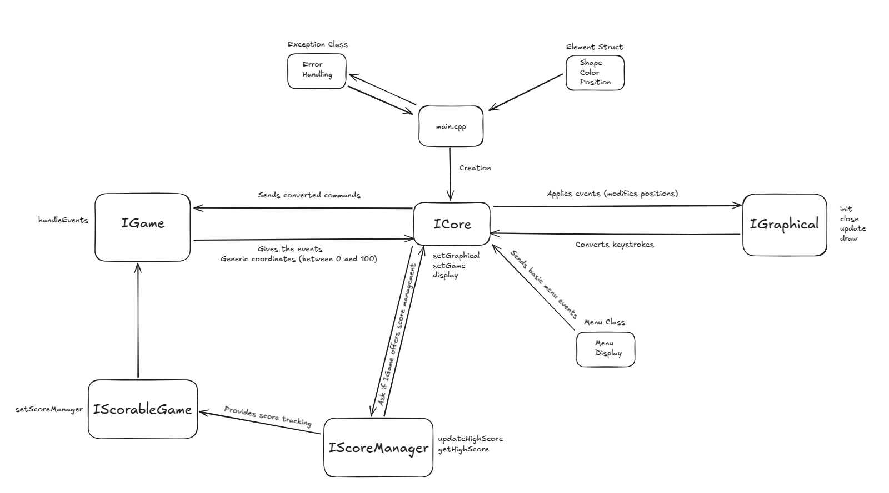

# Technical Documentation - Arcade Architecture

## 🎮 System Overview

The Arcade project implements a modular gaming system using dynamically loaded libraries for both games and graphical displays.

## 📊 Architecture Diagram



## 🔧 Technical Architecture

### Core Components

#### Core Engine
- Manages game states and library transitions
- Handles dynamic library loading/unloading
- Coordinates communication between games and graphics

#### Library System
- **Graphics Libraries**:
  - Implements display and rendering capabilities
  - Supports SFML, SDL2, and NCurses
  - Uses common IGraphics interface

- **Game Libraries**:
  - Individual game implementations
  - Common IGame interface
  - State management per game

### 🔄 Data Flow

1. Core loads required libraries
2. Input events flow through graphics lib to core
3. Core processes events and updates game state
4. Game state changes are rendered via graphics lib

## 💻 Implementation Details

### Interface Specifications

```cpp
// Key interfaces overview
IGraphics {
    // Display methods
    // Input handling
    // Window management
}

IGame {
    // Game logic
    // State management
    // Event processing
}
```

### Loading Mechanism

The dynamic library system uses:
- Runtime library loading
- Symbol resolution
- Interface verification
- Error handling

## 🛠️ Build Requirements

- Modern C++ compiler (C++17)
- Dynamic library support
- Graphics dependencies:
  - SFML 2.5+
  - SDL2
  - NCurses

---
For implementation code, refer to the project source files.
