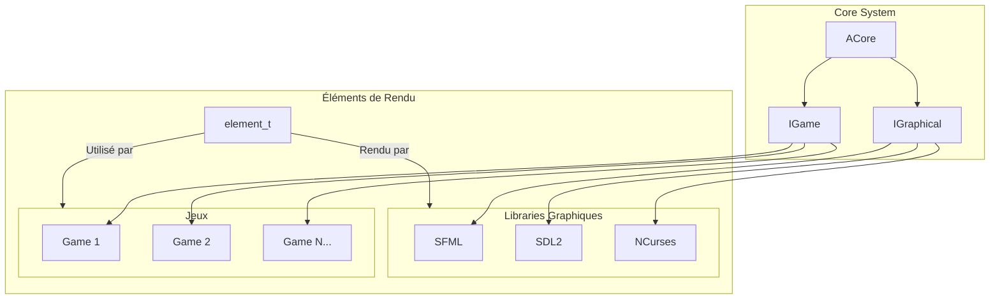

# Architecture du Projet Arcade

## Description Simple

### Core (Noyau)
- **ACore** : Composant central qui :
  - Charge dynamiquement les bibliothèques graphiques
  - Gère les jeux
  - Fait le lien entre graphiques et jeux

### Bibliothèques Graphiques
- Toutes implémentent l'interface **IGraphical**
- Interchangeables en temps réel
- 3 implémentations fournies :
  - SFML
  - SDL2
  - NCurses

### Jeux
- Implémentent l'interface **IGame**
- Indépendants du système graphique
- Communiquent via des éléments standardisés (element_t)

### Éléments
- Structure commune `element_t` qui définit :
  - Type (TEXT, IMAGE, CIRCLE, RECTANGLE, BUTTON)
  - Position
  - Taille
  - Couleur
  - Texte/Chemin d'image

## Flux de Données
1. Le Core charge une bibliothèque graphique
2. Le Core charge un jeu
3. Le jeu génère des éléments à afficher
4. La bibliothèque graphique affiche ces éléments